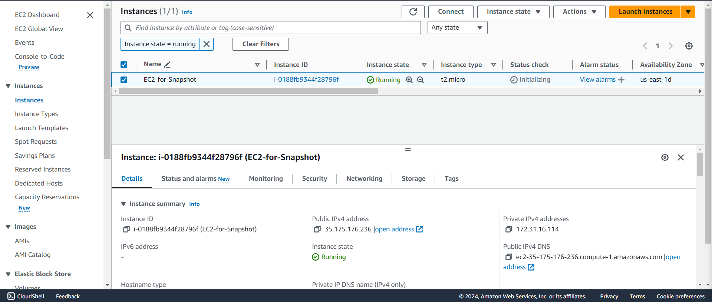
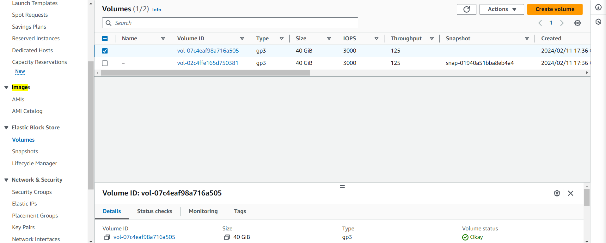
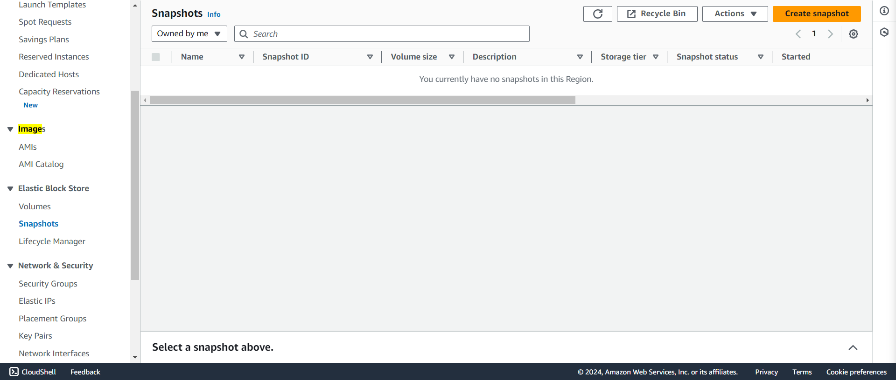
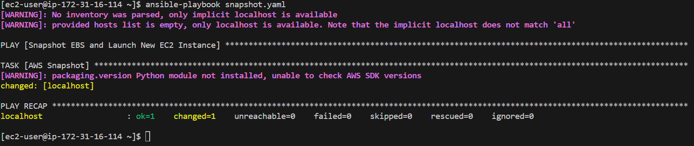
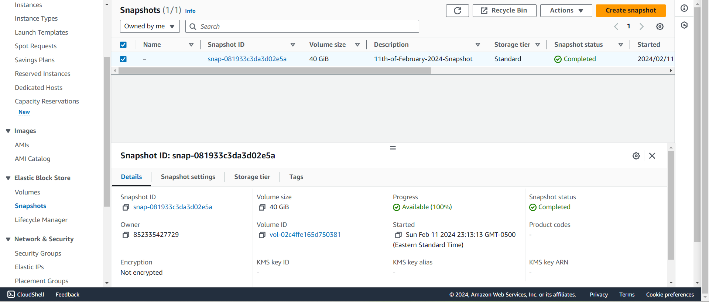

## Automating EC2 EBS Snapshot with Ansible

                     


1. Create EC2 Instance.
 


2. Collect Volume ID.
 


3. Verify Snapshots.
 


4. snapshot.yaml

  ```bash

   ---
- name: Snapshot EBS and Launch New EC2 Instance
  hosts: localhost
  gather_facts: no
  vars:
    ansible_python_interpreter: /usr/bin/python3.9  # Adjust the path to your Python interpreter
  tasks:
    - name: AWS Snapshot
      ec2_snapshot:
       aws_access_key: "key"
       aws_secret_key: "key"
       region: us-east-1
       volume_id: vol-02c4ffe165d750381
       description: 11th-of-February-2024-Snapshot
   
   ```

5. Playbook Results.



6. Validate Snapshot.

